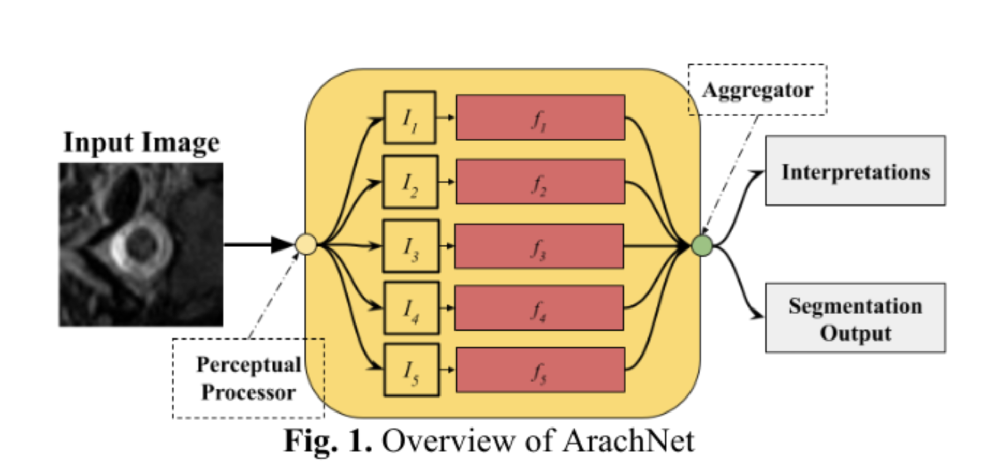
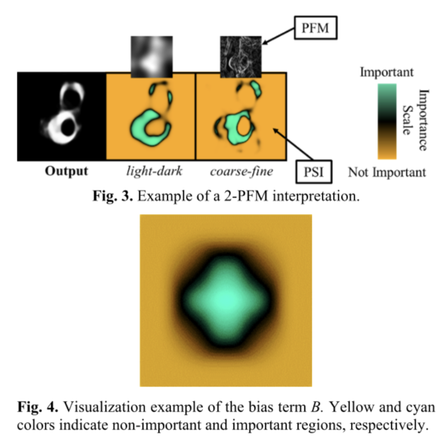

# ARACHNET
[](https://github.com/innoisys/EPU-CNN/)
[](README.md)
[](https://opensource.org/licenses/MIT)

This is the official <b>Tensorflow</b> implementation of ARACHNET: INTERPRETABLE SUB-ARACHNOID SPACE SEGMENTATION USING AN 
ADDITIVE CONVOLUTIONAL NEURAL NETWORK (publised in ISBI2024, official link to be added).

## Paper Abstract
Considering the growing demand for interpretable deep
learning models in medical imaging, this paper introduces
ArachNet, a novel Convolutional Neural Network (CNN)
architecture tailored for spinal sub-arachnoid space
segmentation in MR images. Unlike recent relevant
approaches, ArachNet is an inherently interpretable model
based on the **[EPU-CNN](https://github.com/innoisys/EPU-CNN)** interpretable framework. The model
necessitates an initial image decomposition into perceptually
meaningful components representing structural and
anatomical features of the spinal region. Each perceptual
component is propagated to a dedicated sub-network that
outputs a perceptually meaningful 2D representation,
enabling the interpretation of the overall inferred
segmentation. The experimental evaluation indicates that
ArachNet has great application prospects in the navigation
of minimally invasive surgical tools, such as vine robot
endoscopes, in the spine.



## Usage

**ArachNet**, requires an initial decomposition 
of the input image into perceptual image components,
referred to as Perceptual Feature Maps (PFMs). For the
interpretations to be meaningful, each of these components
needs to render a perceptual quantity, e.g., texture or a range
of values corresponding to different tissues. **ArachNet**,
utilizes a set of CNN sub-networks, each of which is
dedicated to processing a different perceptual component.
Then, the outputs provided by each CNN sub-network are
aggregated through summation, and subsequently
propagated to an activation function for the construction of
the final segmentation. Since the final segmentation is the
result of a known aggregation function, the user can easily
derive the contribution of each PFM to that segmentation.



To use ArachNet, you need to provide a **base CNN architecture** and a **perceptual feature extractor**. In this repository
we provide a Unet base CNN architectures and perceptual feature extractors used in our experiments. An example of usage
is shown below:

```python
from models.arachnet import ArachNet
from models.subnetworks import UnetSubnet

# Initialize the ArachNet model
arachnet = ArachNet(init_size=64, subnet_act="tanh", arach_act="sigmoid", features_num=2,
                                  subnet=UnetSubnet)
```

The `subnet` defines the base CNN architecture. In our implementation `init_size` defines the number of 
features in the first convolutional layers that is incremented  by a factor of **2** in each subsequent convolutional 
block of the base CNN architecture. `num_pfms` defines the number of perceptual feature maps used as input for a particular 
application.

The `subnet_act` defines the output activation function of the base CNN architecture and the `arach_act` defines the inverse
of the link function **g** used to provide the final output of the EPU-CNN model.


### Training

Detailed info to be added soon.

### Interpretations

Detailed info to be added soon.

## Datasets

Detailed info to be added soon.

## TODO

- [ ] Add references to all the paper datasets
- [ ] Complete README.md
- [ ] Add requirements.txt
- [ ] Implement interpretation visualizations in a nice format
- [ ] Add evaluation code
- [ ] Add inference code
- [ ] Add Wavelet PFM extraction
- [ ] Add Multiclass Training and Evaluation code
- [ ] Add the ISBI2024 Reference

## Acknowledgement
This work has been funded by the European Union, under
grant agreement No 101099145, project **[SoftReach](https://softreach.eu/)**.

## Contributors
* [George Dimas](https://www.linkedin.com/in/george-dimas-ph-d-33230bba/)
* Panagiotis Kalozoumis
* Panagiotis Vartholomeos
* [Dimitris Iakovidis](http://is-innovation.eu/iakovidis/)
